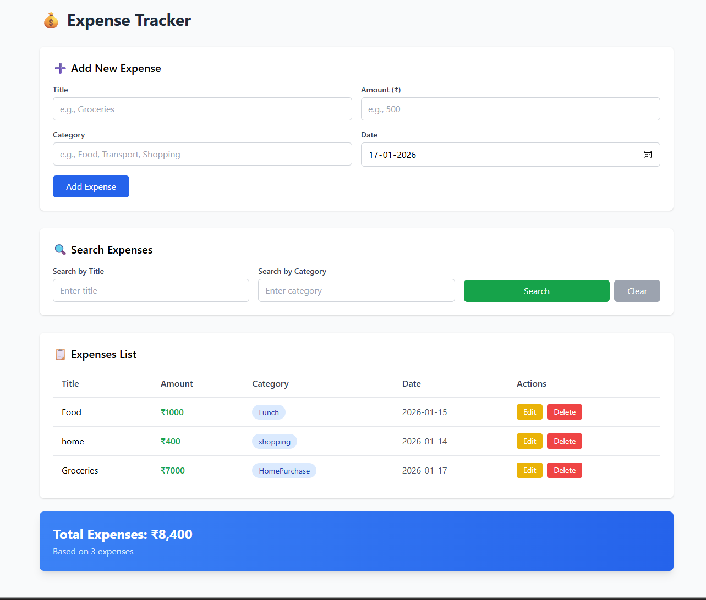
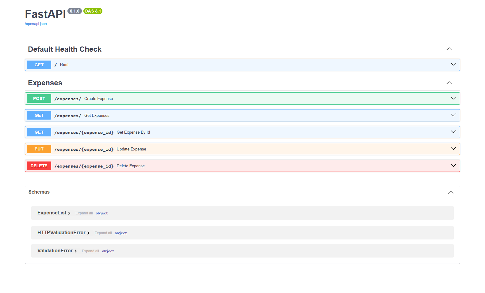

## Expense Tracker – Full Stack Application

A full-stack Expense Tracker application built using FastAPI for the backend and React (Vite) for the frontend.
The application allows users to manage daily expenses with full CRUD operations, filtering, and soft-delete functionality.

## 🚀 Features
- Backend (FastAPI)

- Create, Read, Update, Delete (CRUD) expenses

- Soft delete support using is_deleted

- Filter expenses by:

- Category

- Title

- Fetch expense by ID

- SQLite database using SQLAlchemy ORM

- Modular architecture with routers, schemas, and models

- Frontend (React + Vite)

- Add new expenses

- View all active expenses

- Filter expenses by category and title

- Edit existing expenses

- Soft delete expenses

- Auto refresh after add/update/delete

- Clean and simple UI

## 🧱 Tech Stack
- Backend

- Python 3

- FastAPI

- SQLAlchemy

- SQLite

- Pydantic

- Uvicorn

- Frontend

- React

- Vite

- JavaScript (ES6)

- Fetch API

- CSS
```
📂 Project Structure
Expense_Tracker/
│
├── backend/
│   ├── main.py
│   ├── Database/
│   │   └── database.py
│   ├── Models/
│   │   └── models.py
│   ├── routers/
│   │   └── expenses.py
│   ├── schemas/
│   │   └── schemas.py
│   └── requirements.txt
│
├── frontend/
│   ├── src/
│   │   ├── App.jsx
│   │   └── main.jsx
│   ├── index.html
│   └── package.json
│
├── .gitignore
└── README.md
```
## ⚙️ Backend Setup

1️⃣ Create Virtual Environment
```
python -m venv expensenv
```


## Activate:

Windows
```
expensenv\Scripts\activate
```
2️⃣ Install Dependencies
```
cd backend
pip install -r requirements.txt
```

3️⃣ Run Backend Server
```
uvicorn main:app --reload
```

Backend will run at: http://127.0.0.1:8000


Swagger UI: http://127.0.0.1:8000/docs

⚛️ Frontend Setup

1️⃣ Install Dependencies
```
cd frontend
npm install
```
2️⃣ Run Frontend
```
npm run dev
```


Frontend will run at: http://localhost:5173

## 🔗 API Endpoints (Summary)
```
Method	Endpoint	Description
POST	/expenses/	Create expense
GET	/expenses/	Get all expenses
GET	/expenses/{id}	Get expense by ID
GET	/expenses/?category=&title=	Filter expenses
PUT	/expenses/{id}	Update expense
DELETE	/expenses/{id}	Soft delete expense
```

## 🧠 Key Design Decisions

- Soft delete instead of hard delete to preserve data history

- Router-based architecture for scalability

- ORM-based DB access for safety and maintainability

- Reusable frontend services for API calls

- Separation of concerns between UI, logic, and API layers

## 📷 Application Preview

### 💻 Expense Tracker – Frontend UI


---

### 📄 Backend – FastAPI Swagger UI



## 📌 Future Enhancements

- Authentication & user accounts

- Monthly expense summary

- Charts & analytics

- Pagination

- Hard delete option

- Deployment (Docker / Cloud)

## 👨‍💻 Author

Raj Mohan

GitHub: https://github.com/rajmohan-121

## 📜 License

This project is open-source and free to use for learning and development purposes.
